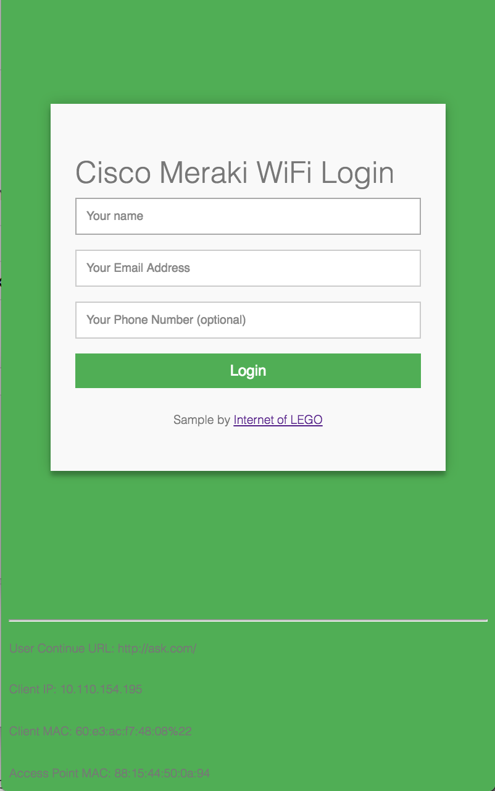

#  Meraki Captive Portal
*Static HTML/JS/CSS Site for a Click-through Splash Page*


## Overview
Cisco Meraki provides cloud managed WiFi with the ability to host your own "Splash Page", which is a captive portal service for authenticating users to join the network. This concept is called an External Captive Portal (ExCaP). 

Meraki provides two splash page modes, **click-through** and **sign-on**. This application will use the click-through method.

To get started just host these files in the public directory on any web server such as Apache or Firebase Hosting and configure your Meraki SSID to use your server. 

Since this is just a starter application. It will authenticate the user on the wirless network but you might still need to "do something" with the submitted form data. This demo simply opens an alert box with the user's name and email address. In reality, you would modify the JavaScript code to save the form data to a database or send a message to an administrator. 

## Installation
* Host the public directory files on a static webserver such as Apache, GitHub or Firebase, or use the included NodeJS express server. 
* Configure the Meraki wireless SSID with a Click-Through splash page authentication
    * Meraki Dashboard --> Configure --> Splash Page: Click-through
* Add the domain address of the webserver to the "Walled Garden" 
    * Meraki Dashboard --> Configure --> Access Control --> SSID:yourSSID --> Walled Garden.
    * Note: You will need to use the IP address instead of the domain name or contact Meraki Support to enable Walled Garden Domain Names
* Point the Meraki Splash page "Customer URL" to the HTML file. `https://yourserver/`
    * Meraki Dashboard --> Configure --> Splash Page --> Custom URL: `https://yourserver.com/splash.html`

* **Option 1:** Static Web Server 
(Apache, Firebase Hosting)
   * Copy public directory to server
* **Option 2:** NodeJS Server
   * In the root directory of the project, run 
```
npm install
node server.js
```
- The server will host the project on port 5000.


## Sample URL paramater string
```
https://yourserver/index.html?base_grant_url=https%3A%2F%2Fn143.network-auth.com%2Fsplash%2Fgrant&user_continue_url=http%3A%2F%2Fask.com%2F&node_id=149624921787028&node_mac=88:15:44:50:0a:94&gateway_id=149624921787028&client_ip=10.110.154.195&client_mac=60:e3:ac:f7:48:08:22
```

## Screenshot


## Demo (using GitHub free hosting)
#### Point your SSID's Splash Page customer URL to:
https://dexterlabora.github.io/excap-clientjs/public/index.html

#### Quick Test (with sample parameters, just click the link to see the mechanics in action!):
https://dexterlabora.github.io/excap-clientjs/public/index.html?base_grant_url=https%3A%2F%2Fn143.network-auth.com%2Fsplash%2Fgrant&user_continue_url=http%3A%2F%2Fspeedof.me%2F&node_id=149624922840090&node_mac=88:15:44:60:1c:1a&gateway_id=149624922840090&client_ip=10.255.60.208&client_mac=f4:5c:89:9b:17:67


## Additional Resources
http://developers.meraki.com/tagged/Splash-Pages

### Written by 
Cory Guynn
2017
www.InternetOfLEGO.com


## LICENSE
The MIT License (MIT)
Copyright (c) 2017, Cory Guynn

Permission is hereby granted, free of charge, to any person obtaining a copy of this software and associated documentation files (the "Software"), to deal in the Software without restriction, including without limitation the rights to use, copy, modify, merge, publish, distribute, sublicense, and/or sell copies of the Software, and to permit persons to whom the Software is furnished to do so, subject to the following conditions:

The above copyright notice and this permission notice shall be included in all copies or substantial portions of the Software.

THE SOFTWARE IS PROVIDED "AS IS", WITHOUT WARRANTY OF ANY KIND, EXPRESS OR IMPLIED, INCLUDING BUT NOT LIMITED TO THE WARRANTIES OF MERCHANTABILITY, FITNESS FOR A PARTICULAR PURPOSE AND NONINFRINGEMENT. IN NO EVENT SHALL THE AUTHORS OR COPYRIGHT HOLDERS BE LIABLE FOR ANY CLAIM, DAMAGES OR OTHER LIABILITY, WHETHER IN AN ACTION OF CONTRACT, TORT OR OTHERWISE, ARISING FROM, OUT OF OR IN CONNECTION WITH THE SOFTWARE OR THE USE OR OTHER DEALINGS IN THE SOFTWARE.
